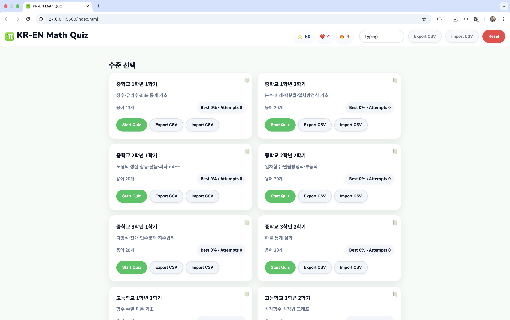

# Math KO–EN Quiz



A playful, Duolingo‑inspired web app to learn Korean ↔ English math terms. Built as a single‑page app with plain HTML/CSS/JS, no frameworks.

Note: This project is vibe coded — it was created by prompting an AI from natural language to working code.

## Why I made this
I was reviewing math terms in Enlish to get prepared for school (It was about a week before school) and thought that it would be useful to have something like quizlet korean math version. I explicitly asked it to look like Duolingo because I've always liked their design.

## Features
- Duolingo‑style HUD: XP ⭐, Hearts ❤️, and Streak 🔥 with micro‑animations
- Three study modes: Multiple Choice, Typing, and Flashcards
- Levels covering all middle and high school semesters (중/고등학교 전 학년·학기)
- Progress saved in your browser via localStorage (persists across sessions)
- Import/Export terms (CSV) and easy data editing via JSON
- Modern, responsive UI with dark mode and reduced‑motion support
- Accessible: semantic markup, ARIA live announcements, and keyboard‑friendly controls
- Celebratory confetti on correct answers

## Quick start
- Open `index.html` directly in a browser, or serve the folder with any static server.
- Your progress and HUD (XP/Hearts/Streak) save automatically.
- Use the in‑app Reset to clear all progress instantly.

Optional local server (pick one):
- VS Code Live Server extension
- Python: `python3 -m http.server 8000`

## Project structure
```
app.js
index.html
README.md
style.css
assets/
  icon.svg
data/
  kr_en_terms.json
```

## Data and customization
- Terms live in `data/kr_en_terms.json` grouped by level (e.g., `ms-1-1`, `hs-3-2`).
- Each term includes at minimum the Korean and English fields; hints/synonyms are optional.
  Example item:
  ```json
  { "ko": "자연수", "en": "natural number", "hint": "1,2,3,…", "synonyms": ["natural numbers"] }
  ```
- You can also Import/Export from the app UI to manage terms via CSV.

## Persistence and reset
- Data is stored in `localStorage` under an app‑specific prefix.
- Use the in‑app Reset to clear XP, Hearts, Streak, session state, and overrides.

## Accessibility
- Announcements for key actions via an ARIA live region.
- Focus styles and logical tab order for keyboard navigation.
- Respects reduced motion and prefers‑color‑scheme (dark mode).

## Contributing
- It’s a simple static site—just open a PR with focused changes.
- Keep it framework‑free, accessible, and mobile‑first.

## Acknowledgments
- Co‑created with an AI assistant. This project is proudly vibe coded.
